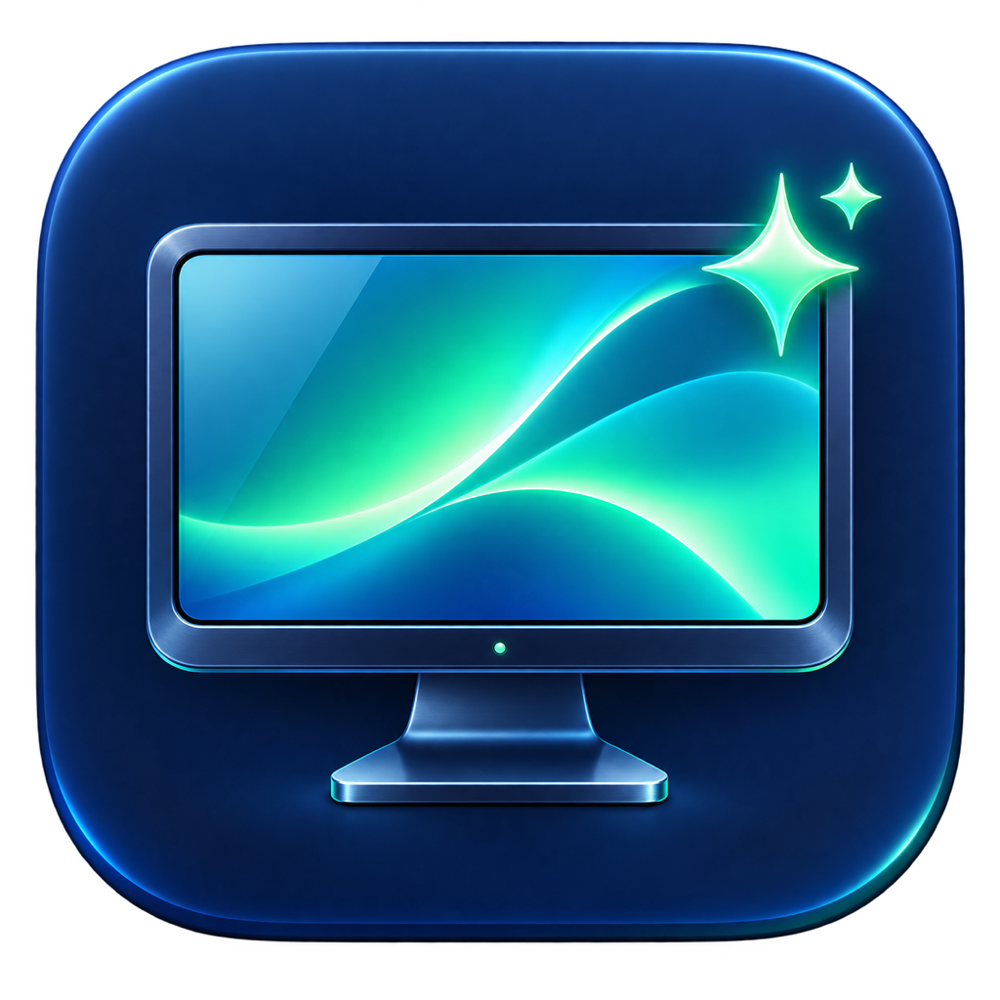

<p align="center">
  
</p>
<h1 align="center">Display Wizard</h1>
<p align="center"><strong>Brightness and scaling, within easy reach.</strong></p>
<p align="center">Apple Silicon · macOS 14+ · Native menu-bar app</p>
<p align="center"><a href="#install">Install</a> · <a href="#everyday-controls">Controls</a> · <a href="#limits">Compatibility</a> · <a href="docs/TESTING.md">Testing</a></p>

A compact native macOS menu-bar utility for display brightness and scaling. Requires Apple Silicon, macOS 14 or later, and Swift 6 command-line tools to build.

## Everyday controls

- Hardware brightness for the built-in display and compatible external monitors.
- Scale buttons based on native panel pixels. Approximate values reflect available macOS modes; exact resolutions and percentages are in each display’s **⋯** menu.
- **Link brightness** preserves percentage-point offsets. **Match** estimates comparable brightness on supported displays, then links their brightness curves. **Fine-tune** saves a visual calibration. Status distinguishes offsets, estimates, calibration, and paused linking.
- **Brightness presets** saves and applies named per-display brightness values.
- **Control–Option–Up/Down** adjusts brightness on the display under the pointer, with a small feedback overlay.
- Display **⋯** menus include resolution favorites, refresh rate, main-display selection, and a shortcut for rotation.
- Resolution changes require confirmation within 15 seconds or revert automatically.

Settings offers **System text size…**, opening macOS Accessibility → Display for compatible apps and system features. **Appearance** contains Display Wizard’s own reading size. Login launch and wake/reconnect brightness restoration are opt-in.

## Install

**Requirements:** an Apple Silicon Mac running macOS 14 or later, Git, and
Swift 6 command-line tools with the macOS SDK and `make`.
External hardware brightness requires a compatible monitor and DDC connection.

### Build and install from source

```sh
git clone https://github.com/betnbd/display-wizard.git
cd display-wizard
bash scripts/build.sh
# Quit Display Wizard using its app menu before installing or updating.
bash scripts/install.sh
open "$HOME/Applications/Display Wizard.app"
```

The installer uses one stable location, `~/Applications/Display Wizard.app`,
verifies the new bundle before replacing the old one, and leaves preferences
untouched. A second launched copy exits instead of creating another hardware
controller. The app menu includes About and the current version.

### Run directly from the build

To try the app before installing it, run this after the build step:

```sh
open "build/Display Wizard.app"
```

Quit that copy before installing. Launch at login is best used with the stable
installed location.

**Download status:** there is currently no published GitHub release or Homebrew
cask. Builds are ad-hoc signed for local use; they are **not Developer ID signed
or notarized** for distribution.

### Update or remove

From your checkout, run `git pull --ff-only`, rebuild, quit the app, and rerun
`scripts/install.sh`. Preferences are stored in
`~/Library/Application Support/DisplayWizard/preferences.json`; upgrades retain
presets, favorites, calibration, and reading size.

To remove the app, turn off its launch-at-login option, quit, and move
`~/Applications/Display Wizard.app` to the Trash. Keep the preferences directory
if you plan to reinstall.

## First run

1. Open the menu-bar panel and check that your displays appear.
2. Adjust one display's brightness, then try **Link brightness** or **Match**.
3. Choose a scale and confirm it within 15 seconds; otherwise it reverts.
4. Save a brightness preset for a setup you use often.

Login launch and wake/reconnect brightness restoration are opt-in in Settings.
If external brightness is unavailable, check the monitor's DDC/CI setting and
connection; support varies by hardware. **Match** estimates perceived brightness,
while **Fine-tune** lets you adjust the result visually.

## Build and validate

```sh
bash scripts/test.sh
```

See [verification notes](docs/TESTING.md) for test coverage and the manual hardware
checks needed for brightness, hotkeys, sleep/wake, and reconnection.

## Implementation

SwiftUI views are separated into the main dropdown, display card, and settings. Shared typography follows the app’s reading size and macOS appearance. `AppModel` coordinates display lifecycle, writes, previews, and persistence. Its injectable service boundary supports simulated recovery tests. `HardwareService` serializes blocking hardware traffic off the main thread. Pure helpers calculate scale choices, linked offsets, and estimated brightness targets.

`DisplayBackend` uses CoreGraphics, private DisplayServices interfaces, and the bundled MIT-licensed [m1ddc](https://github.com/waydabber/m1ddc) helper. Vendor source and license are retained in `Vendor/m1ddc`; generated helper binaries and build caches are excluded from Git. Artwork provenance is in `Assets/README.md`.

## Limits

Brightness matching is an estimate, not an optical measurement. The Mac profile uses its active SDR range and native linear brightness reading; the Dell U2725QE profile uses a nominal 450-nit maximum. Visual calibration improves the match but ambient light, HDR, automatic brightness, and monitor picture settings can change perception. Unsupported displays retain independent controls.

DDC support depends on the monitor and connection. The app does not create custom modes, virtual displays, HDR boosts, or software dimming overlays. System text sizing only affects apps and features that support the macOS setting.

See [verification notes](docs/TESTING.md). The compact controls take inspiration from [Omarchy’s monitor panel](https://github.com/basecamp/omarchy/blob/quattro/shell/plugins/panels/monitor/Panel.qml).

Memory behavior: the dropdown and keyboard-feedback views are released when hidden. Matching support loads only when requested or required by saved matching settings. A small session object preserves the settings page and unfinished preset name across dropdown openings.

## License and credits

Display Wizard is released under the [MIT License](LICENSE). The bundled [m1ddc](https://github.com/waydabber/m1ddc) helper retains its
[MIT license](Vendor/m1ddc/LICENSE) and [upstream record](Vendor/m1ddc/UPSTREAM.md).
Thank you to its maintainers for the Apple Silicon DDC foundation.

Built by [Ben](https://github.com/betnbd). Pair it with
[Mac Themes](https://github.com/betnbd/mac-themes) for coordinated wallpapers and app colors.
